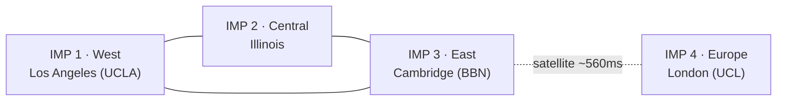

# Network topology

## Seed backbone

We (the BBN role) run a small, redundant spine of always-on IMP emulators at the real ARPANET's
anchor regions, so there is always a nearby hub no matter where a member joins.

| IMP # | Hub | Real-world anchor | Rationale |
|---|---|---|---|
| 1 | **West** | Los Angeles (UCLA) | Site of the historic IMP #1 (Sept 2, 1969). Covers the West Coast. |
| 2 | **Central** | Illinois (Urbana / Chicago) | A real node *and* geographically central — best coverage for the Midwest & South. |
| 3 | **East** | Cambridge, MA (BBN) | BBN built the IMPs and ran the NCC — the authentic operator's home. Densest cluster. |
| 4 | **Europe** | London (UCL) | The transatlantic gateway; UCL/NORSAR came online ~1973 — the documented way "far away" joined. |

**Open taste calls** (do not block the design):
- Central = **Illinois** (coverage) vs **Utah / Salt Lake** (original-4 resonance, thinner region).
- Europe in the seed **from day one** vs added when the first European member appears.

## The spine

A US triangle (so no single hub failure partitions the country) plus Europe off the East hub:



(Plain-text fallback:)

```
        [1] West ────────── [3] East ──~~ atlantic ~~── [4] Europe
        (LA)   \            (Cambridge)                    (London)
                \            /
                 \          /
                  [2] Central
                   (Illinois)
```

- Trunks: **1–2, 2–3, 1–3** (redundant US backbone — every US hub has ≥2 trunks) plus **3–4**
  (transatlantic).
- Europe starts **single-homed** to East — authentically fragile, like the real 1973 transatlantic
  link. It gains a second trunk once a second European IMP exists.

## Numbering policy

- Backbone hubs take IMP **1–4**.
- Member IMPs are assigned from the **5–63** pool by the NIC.
- Each IMP has **~4 host ports** (old-leader limit), so the four hubs alone offer 16 host-attach
  slots before any member needs to run their own IMP.

## Geographic continuity — the placement ruleset

Continuity is emergent from a small set of rules, not a fixed grid:

1. **The backbone spine is the skeleton** everything hangs off; it keeps the net always-connected.
2. **A new host attaches to the nearest IMP with a free host port** (backbone or member), chosen by
   real latitude/longitude.
3. **A new IMP is created only for a real geographic gap** (or a member who specifically wants to run
   one) and **trunks to its 2 nearest existing IMPs** — so topology grows outward organically and
   keeps the ≥2-trunk redundancy rule.
4. **Placement uses real geography; trunks prefer short hops; the backbone carries the long/ocean
   spans.** A European member trunks to the Europe hub, which crosses to East — one authentic
   long-haul link, not a spaghetti strand.
5. **Prefer host-attach over new-IMP** — the lever that keeps the 63-IMP ceiling far away (see
   [architecture.md](architecture.md)).

**Node location is the member's real physical location** (recommended), so the map is a genuine map
of the community rather than everyone vanity-clustering at the famous historical sites. A descriptive
*label* ("MIT-style ITS box") is fine; the dot stays where the machine really is. *(Open call.)*

## Using the real 1973 map

The real map is exceptionally well documented (BBN logical + geographic maps, roughly monthly; RFC
597 host list, Dec 1973). We use it as a **reference**:

- where to anchor the backbone hubs (the real anchor regions above),
- the placement/redundancy logic (IMPs where clusters form, short trunks, a redundant spine),
- seed data for the host table / directory.

We do **not** populate it with recreated historical nodes — see the living-network model in
[architecture.md](architecture.md).
